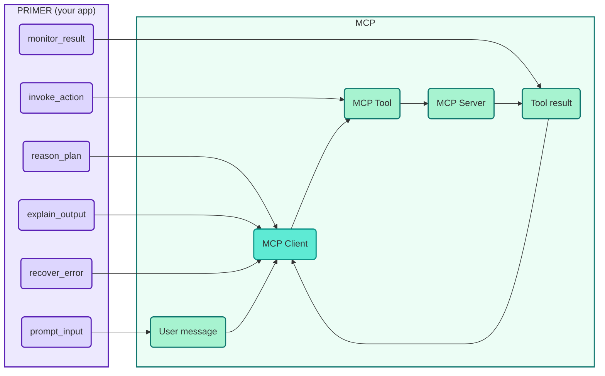

# How MCP is masked PRIMER

MCP is PRIMER in disguise: the same loop (reason → invoke → monitor → explain or recover), but standardized as a protocol. Your app’s “functions” become **MCP tools** (and read-only data becomes **MCP resources**); the **MCP client** runs the loop and talks to **MCP servers** instead of your in-process code. This page shows the PRIMER prompt, maps each part to MCP, and sketches how the implementation translates.

## The PRIMER prompt and its MCP counterparts

Below is the prompt we gave the model. Each part is labeled with the **MCP concept** it corresponds to.

| Prompt part | MCP counterpart |
|-------------|------------------|
| **Steps** (prompt_input, reason_plan, invoke_action, monitor_result, explain_output, recover_error) | **Client loop**: user message → model reasons → client invokes **tool** → gets **tool result** → model explains or client handles error. |
| **invoke_action** (function name + input) | Client calls a **tool** on an **MCP server** with arguments. |
| **monitor_result** (function output) | **Tool result** returned by the server to the client. |
| **Functions** (getTrainStatus, getPNRStatus) | **MCP tools** — server advertises name, description, parameters; client invokes them. |
| **getTrainNumberMapping()** (lookup) | **MCP resource** — read-only data the client fetches by URI, not an action. |

## Diagram: PRIMER prompt → MCP



**In words:**  
**prompt_input** → user message to the **client**. **reason_plan** → client sends conversation to model. **invoke_action** → client calls a **tool** on a **server**. **monitor_result** → **tool result** from server back to client. **explain_output** / **recover_error** → client shows answer or handles error.

## Prompt with part-by-part mapping

```text
Follow the PRIMER steps to handle user requests using the available functions.
                                                    ↑
                                    MCP: Client enforces this loop

Steps:
- prompt_input: Wait for user input.          → MCP: User message (client receives it)
- reason_plan: Decide which function to call.  → MCP: Model reasoning (client sends to model)
- invoke_action: Call the chosen function...   → MCP: Client invokes a TOOL on a server
- monitor_result: Capture and observe output.  → MCP: Client receives TOOL RESULT from server
- explain_output: Format and return answer.   → MCP: Model output (client shows to user)
- recover_error: Handle any issues.           → MCP: Client handles errors

Functions:
1. getTrainStatus(train_no: str)   → MCP: TOOL (action with parameters)
2. getPNRStatus(pnr: str)         → MCP: TOOL (action with parameters)
3. getTrainNumberMapping()        → MCP: RESOURCE (read/lookup by URI, not a tool)
```

## Implementation sketch

How we implemented the loop in our app (and how MCP does the same over the wire):

- **Tools**: A dictionary mapped *tool* names to implementations: `getTrainStatus`, `getPNRStatus`. The train-number mapping was implemented as a callable in that app, but conceptually it’s a **resource** (read/lookup data), not an action—in MCP you’d expose it as a **resource** the client reads rather than a tool it invokes.
- **Messages**: Conversation starts with the system prompt; each user turn is sent as a `prompt_input` JSON message.
- **Loop**: We call the model, parse the response as JSON, then:
  - **`explain_output`** → print the response and break (done).
  - **`invoke_action`** → look up the function in the tools dict, call it with `step["input"]`, then append either a `monitor_result` (success) or `recover_error` (exception) message and continue the loop.
- **Errors**: Invalid JSON or other parsing errors are caught and the loop breaks with a clear message.

So the “invoke” and “monitor” steps were implemented in our app: we ran the chosen function and fed the result (or error) back into the conversation as the next message. **MCP does the same for tools**; for things like the train-name→number mapping, MCP uses **resources** (read-only data the client fetches by URI) instead of a separate “tool.”

Full implementation: [app.py](https://github.com/shantanukhond/YT-Assets/blob/main/AiAgent/code/app.py).

---

Previous: [What is PRIMER](/docs/understanding-primer/what-is-primer). For MCP concepts: [MCP Core Concept](/docs/mcp-core/overview).
